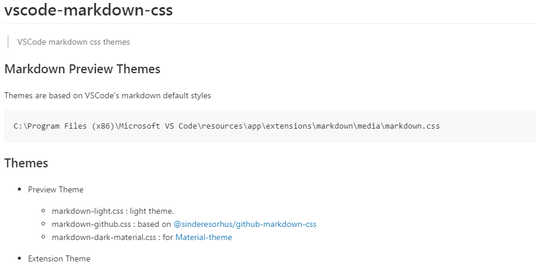
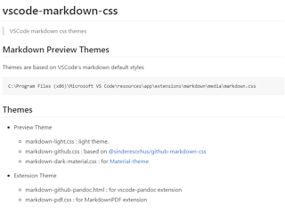
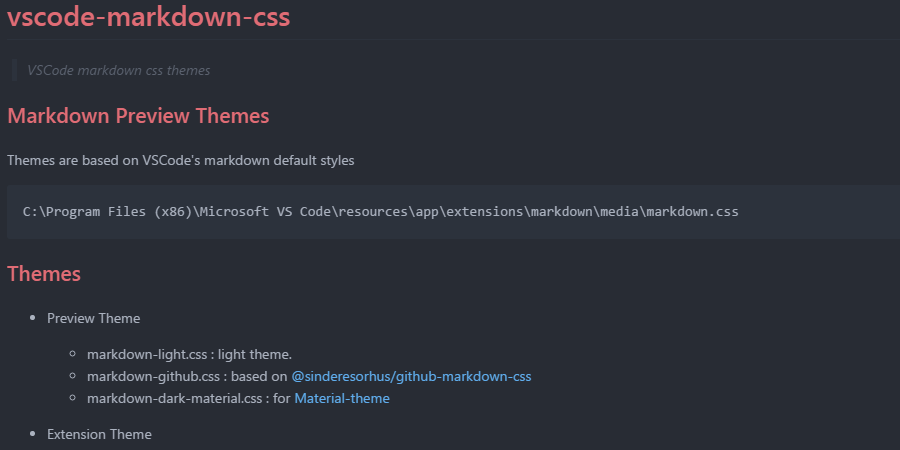

# vscode-markdown-css

> VSCode markdown css themes

## Markdown Preview Themes

Themes are based on VSCode's markdown default styles

    C:\Program Files (x86)\Microsoft VS Code\resources\app\extensions\markdown\media\markdown.css

## Themes

- Preview Theme

  - markdown-light.css : light theme.
  - markdown-github.css : based on [@sinderesorhus/github-markdown-css](https://github.com/sindresorhus/github-markdown-css)
  - markdown-dark-material.css : for [Material-theme](https://marketplace.visualstudio.com/items?itemName=zhuangtongfa.Material-theme)

- Extension Theme

  - markdown-github-pandoc.html : for vscode-pandoc extension
  - markdown-pdf.css : for MarkdownPDF extension

## Preview





## Usage

Copy files to your computer. Edit `Settings.json` in [Settings File Location](https://code.visualstudio.com/Docs/customization/userandworkspace#_settings-file-locations) like below :

```json
// Preview Settings
// Github style for all VSCode theme
"markdown.styles": [
    "[YOUR_PATH]/vscode-markdown-css/markdown-github.css"
],
// Light/Dark style for Light/Dark VSCode theme
"markdown.styles": [
    "[YOUR_PATH]/vscode-markdown-css/markdown-light.css",
    "[YOUR_PATH]/vscode-markdown-css/markdown-dark-material.css"
],
// Extension - MarkdownPDF
"markdown-pdf.styles": [
    "[YOUR_PATH]/vscode-markdown-css/markdown-pdf.css"
],
// Extension - vscode-pandoc
"pandoc.htmlOptString": "-s -f markdown_github -t html5 -H [YOUR_PATH]/vscode-markdown-css/markdown-github-pandoc.html",
```


## License

Licensed under the [MIT](LICENSE.md) License.